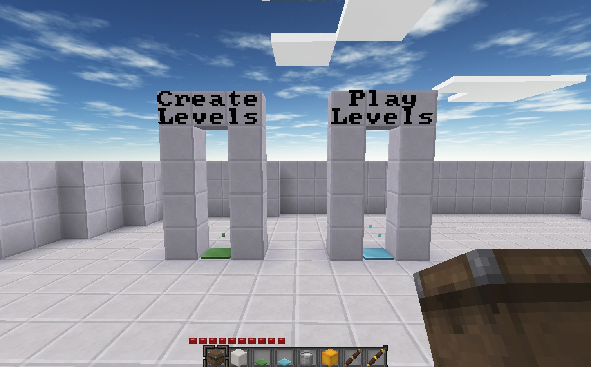

# Inside the Box Docker

[Inside the Box](https://gitlab.com/sofar/insidethebox) is a Minetest game that allows players to create, play and share puzzles.

This project is a Docker Image that contains a minimal playable Inside the Box world.
It is based on the official [Minetest Doker image](https://github.com/minetest/minetest#docker).



## Prerequisites

Docker needs to be installed.

A user named `minetest` has to be available on the system, and have the id 30000.
For example, on a Debian-based system, you'd create the user with the following command:

```
sudo adduser minetest --uid 30000 --disabled-password --disabled-login --no-create-home -gecos ""
```

## Creating the image

In the root directory of this repository, issue the following command:

```
docker build -t insidethebox .
```

## Running a container

### Game data directory

Before creating and running a container, create directory for game data (and configuration). This directory needs to be owned by the `minetest` user.
Here's an example:

```
mkdir itb-game-data
chown minetest:minetest itb-game-data
```

Note that the `chown` command might require elevated privileges (sudo).

### Docker cli

```
docker run \
    --rm \
    -ti \
    --name my-insidethebox-server \
    -u "30000:30000" \
    -p "30000:30000" \
    -v $(pwd)/itb-game-data/:/var/lib/minetest/.minetest \
    insidethebox
```

### docker-compose

Here's a sample docker-compose.yml file:

```
---
version: "2.1"
services:
  minetest:
    image: insidethebox
    container_name: itb-server
    volumes:
      - ./itb-game-data/:/var/lib/minetest/.minetest/
    ports:
      - 30000:30000/udp
    user: "30000:30000"
    restart: unless-stopped
```

### Default admin user

When creating a new server, the default admin user name is `wolf` and there's no password.
To add other admins, change the `./itb-game-data/minetest.conf` configuration file and specify the new admin user name on the `name = ...` line.
After that, just connect with a new user with that name.
